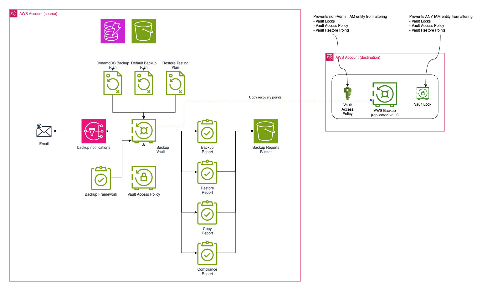

# AWS Backup Blueprint

*v1.1.0 is coming*

We have new documentation currently under review [here](https://github.com/NHSDigital/terraform-aws-backup/pull/15), and will be merging it within the next few days.  If you want to get involved in the review, please comment on the pull request and reach out to the Engineering Technical Authority to get involved.

## Introduction

This module addresses the Engineering Red Line [Cloud-6](https://nhs.sharepoint.com/sites/X26_EngineeringCOE/SitePages/Red-lines.aspx#cloud-infrastructure).  It provides both a business-as-usual backup facility and the ability to recover from ransomware attacks with a logically air-gapped backup[^1] in a separate AWS account.

It is a simple and easy to consume solution for provisioning AWS Backup with terraform[^2].  The headline features we aim to provide are:

* Immutable storage of persistent data for disaster recovery, with no possibility of human error or malicious tampering.
* Backup and restore within an AWS account, with the potential to support any AWS service that AWS Backup supports.
* Backup and restore to a separate account, allowing for recovery from a situation where the original account is compromised.
* Customisable backup plans to allow for different retention periods and schedules appropriate to the data, product, and service.
* Notifications to alert on backup failures and successes, and reporting for wider visibility.

This solution does not intend to provide backup and restoration of application code or executable assets.  It is *only* for persistent storage of application data that you cannot afford to lose, and typically this will be data that you cannot recreate from another source.

Similarly there is no mechanism within this solution to ensure that any schema versions or data formats are compatible with the live version of the application when it is restored.  You may wish to include an application version tag in your backups to ensure that you can identify a viable version of the application to restore the data to.

Setting retention periods and backup schedules will need the input of your Information Asset Owner.  We can't choose a default that will apply to all situations.  We must not hold data for longer than we have legal rights to do so, and we must also minimise the storage cost; however we must also ensure that we can restore data to a point in time that is useful to the business.  Further, to comply fully with [Cloud-6](https://nhs.sharepoint.com/sites/X26_EngineeringCOE/SitePages/Red-lines.aspx#cloud-infrastructure) you will need to test the restoration process. Ransomware often targets backups and seeks not to be discovered. The immutability of the backups provided by this blueprint is a strong defence against this, but to avoid losing all your uncompromised backups, you will need your restoration testing cycle to be *shorter* than the retention period.  That will guarantee that any ransomware compromise is discovered before all uncompromised backups are deleted.  If your retention period was six months, for instance, you might want to test restoration every two months to ensure that even if one restoration test is missed, there is still an opportunity to catch ransomware before your last good backup expires.

Today, the AWS services supported by these modules are:

* S3
* DynamoDB

The terraform structure allows any service supported by AWS Backup to be added in the future.  If you find that you need to apply this module to a new service, you will find that you can do so but we then need you to contribute those changes back to this repository.

There is some terminology that is important to understand when working with AWS Backup vaults. It uses the terms "governance mode" and "compliance mode". In governance mode, a backup vault can be deleted, and mistakes can be fixed.  In compliance mode the backup vault is locked and cannot be deleted.  Mistakes persist.  The default mode is governance mode.

*DO NOT SWITCH TO COMPLIANCE MODE UNTIL YOU ARE CERTAIN THAT YOU WANT TO LOCK THE VAULT.*

A compliance-mode vault that has passed a cooling-off period is intentionally impossible to delete.  This is a feature, not a bug: we want to ensure that the stored data cannot be tampered with by an attacker or their malware, even in the face of collusion.  This is good for data that you cannot afford to lose, but it is bad if you have misconfigured retention periods.

Again: *DO NOT SWITCH TO COMPLIANCE MODE UNTIL YOU ARE CERTAIN THAT YOU WANT TO LOCK THE VAULT.*

Please consult the AWS documentation on [vault locks](https://docs.aws.amazon.com/aws-backup/latest/devguide/vault-lock.html) for more information.

### Infrastructure

The code provided here is divided into two modules: `modules/aws-backup-source`, and `modules/aws-backup-destination`. The `source` module is to deploy to any account holding data that needs to be backed up and restored. The `destination` module is to configure a dedicated AWS account to maintain a replicated copy of vault recovery points from the source account: it holds a backup of the backup.  You will need both of these accounts provisioned ahead of time to use the full solution, but you can test the source and destination modules within the same account to check that the resources are provisioned correctly.

These modules will deploy a number of AWS resources:

* In the source account:
  * Vault
  * Backup plans
  * Restore testing
  * Vault policies
  * Backup KMS key
  * SNS topic for notifications
  * Backup framework for compliance
* modules/destination
  * Vault
  * Vault policies
  * Vault lock



Note that there are always two vaults.  In most restoration cases you should only need the `source` vault, so there is no need to copy data from the second, `destination`, vault.  The latter is only used in the case of a disaster recovery scenario where the source account is compromised beyond use.  As such the recovery time and recovery point objectives you will care about for situations in which the second vault is used should take this into account.

## Developer Guide

This document will guide you through the set-up and deployment of the AWS Backup solution in a typical project.  You will need:

* Two AWS accounts: one for the source and one for the destination.  The source account will hold the data to be backed up, and the destination account will hold the backup of the backup.  You will need to know the account IDs of both accounts, and you will need to be able to create roles and assign permissions within both accounts.
* The ARNs of IAM roles in each account that allows terraform to create the resources.  You will need to be able to assume these roles from your CI/CD pipeline.
* A CI/CD pipeline.  I'm using GitHub Actions in the examples below, but you can use any CI/CD pipeline that can run terraform.

Since it can be tricky to configure terraform to assume different roles within the same invocation, I've split the example configuration into two, with terraform to be applied once per account.  The `examples/source` configuration is for the account that holds the data to be backed up, and `examples/destination` is for the account that will hold the backup of the backup.  You will need to deploy both configurations to have a complete solution, and output from the `destination` configuration needs to be passed to the `source` configuration, so that the `source` configuration can find the `destination` vault.

The other directories in `examples/` hold examples of the permission configuration for the IAM roles in each account.  They need to be assigned outside the pipeline itself.  For the permissions needed in the destination account, see `examples/destination-bootstrap/permissions.tf`: you may wish to use that file as a starting point for your own permissions.  Similarly for the source account, see `examples/source-bootstrap/permissions.tf`.

This blueprint supports backups of S3 and DynamoDB resources, but for brevity this first implementation will only show the backing up of S3 buckets, with DynamoDB backups explicitly disabled.

I will assume that your project uses the [repository template structure](https://github.com/nhs-england-tools/repository-template).  In that structure, the terraform configuration is in the `infrastructure/modules` and `infrastructure/environments` directories.  The `modules` directory contains the reusable modules, and the `environments` directory contains the environment-specific configuration.  If this does not match your project structure, you will need to adapt the instructions accordingly.  I will also assume that you are applying this configuration to your `dev` environment, which would be found in the `infrastructure/environments/dev` directory, with `infrastructure/environments/dev/main.tf` as an entry-point.

Similarly I will assume that you have your backup destination account configuration at `infrastructure/environments/dev-backup`.  We'll configure that first.

Copy the `modules/aws-backup-source` and `modules/aws-backup-destination` directories into your `infrastructure/modules` directory, giving you `infrastructure/modules/aws-backup-source` and `infrastructure/modules/aws-backup-destination`.

### IAM roles

Ensure that you have added your IAM role ARNs to your CI/CD pipeline configuration.  To follow along with the CI/CD examples below, you should set:

* `AWS_ROLE_ARN` to the ARN of the role in the source account that terraform will assume to create the resources.
* `AWS_BACKUP_ROLE_ARN` to the ARN of the role in the destination account that terraform will assume to create the resources.

These values contain the AWS account ID, so where your CI/CD pipeline choice supports them, these values should be treated as secrets.

Add the permissions from the `examples/destination-bootstrap` and `examples/source-bootstrap` files to the roles in the destination and source accounts respectively.

### Destination account configuration

Now, copy the file `examples/destination/aws-backups.tf` to your project at `infrastructure/environments/dev-backup/aws-backups.tf`.  Read it and make sure you understand the comments.  It instantiates the destination vault, but in order to do so it also needs to create a KMS key to encrypt it.  It also needs to know the ARN of terraform's role in the *source* account, to be passed in as the `source_terraform_role_arn` variable.  I prefer to configure this as an environment variable in my GitHub Actions pipeline, where the terraform invocation looks like this:

```yaml
      - name: Authenticate with AWS over OIDC for backup
        uses: aws-actions/configure-aws-credentials@v4
        with:
          role-to-assume: ${{ secrets.ASSUME_BACKUP_ROLE_ARN }}
          role-session-name: my-shiny-project-github-deploy-backup-infrastructure
          aws-region: eu-west-2
          unset-current-credentials: true
          audience: sts.amazonaws.com

      - name: Terraform plan
        id: backup_plan
        run: |
          cd ./terraform/environments/backup
          terraform init -backend-config=backend-config/prod.conf
          terraform workspace select -or-create prod
          terraform init
          terraform plan
        env:
          TF_VAR_source_terraform_role_arn: ${{ secrets.ASSUME_ROLE_ARN }}

      - name: "Terraform apply to backup account"
        id: apply_backup
        run: |
          cd ./terraform/environments/dev-backup
          terraform apply -auto-approve -input=false
          echo TF_VAR_destination_vault_arn="$(terraform output -raw destination_vault_arn)" >> $GITHUB_ENV
        env:
          TF_VAR_source_terraform_role_arn: ${{ secrets.ASSUME_ROLE_ARN }}
```

Note that in the last step the `ASSUME_ROLE_ARN` is the ARN of the role in the *source* account, not the role in the destination account.  You will also see here that we're passing the `destination_vault_arn` output from the destination configuration to the environment, so that the source configuration can find the destination vault.

This means that the destination configuration needs to be applied *before* the source configuration.  If you are using the above configuration, insert it before the OIDC authentication step for the source configuration.

To choose which resources will be backed up by AWS Backup, you need to tag them with the tag `NHSE-Enable-Backup`.  So do that now: in your *existing* terraform configuration, add the tag to the resources that you want to back up, and apply it.  For example, if you want to back up an S3 bucket, you would add the tag to the bucket resource:

```terraform
resource "aws_s3_bucket" "my_precious_bucket" {
  bucket = "my-precious-bucket"

  tags = {
    "NHSE-Enable-Backup" = "True"
  }
}
```

The backup plan supplied in the module configuration will back up all resources with this tag, and the matching is case-sensitive.  It *will not* match a resource tagged `true` or `TRUE`, only `True`.

One detail to be aware of is that AWS insists on versioning being switched on to back up S3 buckets.  If you don't already have a lifecycle policy set for the bucket you want to protect, this will work:

```terraform
resource "aws_s3_bucket_versioning" "my_precious_bucket" {
  bucket = aws_s3_bucket.my_precious_bucket.id
  versioning_configuration {
    status = "Enabled"
  }
}

resource "aws_s3_bucket_lifecycle_configuration" "my_precious_bucket" {
  bucket = aws_s3_bucket.my_precious_bucket.id
  depends_on = [aws_s3_bucket_versioning.my_precious_bucket]

  rule {
    status = "Enabled"
    id      = "expire-previous-versions"
    filter {}
    noncurrent_version_expiration {
      noncurrent_days = 30
    }
  }
}
```

### Source account configuration

Now copy the file `examples/source/aws-backups.tf` to your project as `infrastructure/environments/dev/aws-backups.tf`.  Read it and make sure you understand the comments.

In addition to the core backup vault and associated resources supplied by the `aws-backup-source` module, the example configuration supplies an S3 bucket for backup reports to be stored in, and a KMS key for notifications to be encrypted with.  These are likely to be moved into the `aws-backup-source` module in future versions, but for now they are in the example configuration because the project from which the blueprint was extracted from had these resources already in place.

The backup plan configuration in `examples/source/aws-backups.tf` looks like this:

```terraform
   backup_plan_config                 = {
                                        "compliance_resource_types": [
                                          "S3"
                                        ],
                                        "rules": [
                                          {
                                            "copy_action": {
                                              "delete_after": 4
                                            },
                                            "lifecycle": {
                                              "delete_after": 2
                                            },
                                            "name": "daily_kept_for_2_days",
                                            "schedule": "cron(0 0 * * ? *)"
                                          }
                                        ],
                                        "selection_tag": "NHSE-Enable-Backup"
                                      }
```

You must change the numbers here to match the requirements of your project.  The `copy_action` `delete_after` entry is the number of days that the backup will be kept in the destination account, so in this example we will be retaining snapshots in the air-gapped account for four days.  The `lifecycle` `delete_after` entry is the number of days that the backup will be kept in the source account.  The value of two days in this example is shorter, but you may wish to either match the destination and source (so that you know any individual snapshot is in more than one place), or make the duration in the source account longer than in the destination to minimise the storage cost while retaining a level of contingency.

As mentioned in the introduction, you will need to speak to your Information Asset Owner to determine the correct values for your project.  The values here are intentionally too short for a practical production system, and will fail checks built into the backup framework.

The `name` is an arbitrary label.  Change it to match the actual schedule.  It will appear in the AWS Backup console, so make it meaningful.

The `schedule` is a cron expression that determines when the backup will be taken.  If you are unfamiliar with cron syntax, AWS document it [here](https://docs.aws.amazon.com/eventbridge/latest/userguide/eb-scheduled-rule-pattern.html#eb-cron-expressions).  In this example, the backup will be taken at midnight every day.  If you are testing this configuration in a development environment, you may wish to change this to a more frequent schedule, or to a more convenient time of day.

The final detail to be aware of here is the `selection_tag`.  This defines the tag that AWS Backup will use to determine which resources to back up, and which you will have seen above.  Resources that you want to back up must have this tag.  If you have followed the instructions above, you will have already tagged the resources you want to back up.  The name of the tag has been chosen such that it is unlikely to conflict with any existing tags.

The `aws-backup-source` module requires the ARN of the role in the destination account that terraform will assume to create the resources.  This is passed in as the `destination_terraform_role_arn` variable.  In my usage of the blueprint, this is passed in as an environment variable in the GitHub Actions pipeline. The terraform invocation looks like this:

```yaml
      - name: Authenticate with AWS over OIDC
        uses: aws-actions/configure-aws-credentials@v4
        with:
          role-to-assume: ${{ secrets.ASSUME_ROLE_ARN }}
          role-session-name: tech-radar-backend-github-deploy-infrastructure
          aws-region: eu-west-2
          unset-current-credentials: true
          audience: sts.amazonaws.com

      - name: Terraform plan
        id: plan
        run: |
          cd ./terraform/environments/main
          terraform init -backend-config=backend-config/prod.conf
          terraform workspace select -or-create prod
          terraform init
          terraform plan

      - name: "Terraform apply to main account"
        run: |
          cd ./terraform/environments/main
          terraform apply -auto-approve -input=false
```

When the earlier step wrote to the `$GITHUB_ENV` file, it wrote the `destination_vault_arn` output from the destination configuration.  This is passed in as the `destination_vault_arn` variable to the source configuration, so we don't need to explicitly configure it here.  Your CI/CD pipeline will need to ensure that the destination configuration is applied before the source configuration and that the `destination_vault_arn` output is passed along, and probably has a similar mechnaisim to the above.

## Next steps

* If you haven't already, set up the appropriate steps in your CI/CD pipeline to deploy the destination and source configurations.
* Run the deployment.  You want to only do this from your CI/CD pipeline, so that the roles are assumed correctly, and so that you know it is properly automated.
* Check the AWS Backup console to ensure that the vaults have been created, and that the backup plans are in place.
* Allow a backup to run, and check that the backup checkpoint appears in both vaults.
* Test a restoration from the source vault.  This is a critical step, as you need to know that you can restore from the source vault in the event of a ransomware attack.  If you can't, you need to know now, not when you're under attack.
* Test a restoration from the destination vault.
* Document your restoration processes so that you can repeat the test in the future.
* Configure and test notifications.  See the `notifications_target_email_address` variable in the `aws-backup-source` module for an example of how to configure this.
* Check that the backup reports are being stored in the S3 bucket.
* Switch to compliance mode in the destination vault.  You may have caught the hints above that this is a one-way operation, so make sure you're ready to do it.  But do it: it's the end point we need to reach.  You will need to set the `enable_vault_protection`, `vault_lock_type`, and `changeable_for_days` variables correctly in the `destination` module.

## FAQs

None yet.  If you have a question, please raise an issue.

## Procedural notes

This is very much a v1 product, so thank you for persisting.  Obvious features that we will want to add, and that you can expect in the future, include:

* Centralised reporting on installation and backup status.
* Moving the S3 bucket and KMS key from the source configuration to the source module, and the KMS key from the destination configuration to the destination module.  This will shrink the footprint of the example configuration and make it easier to use.
* Support for more AWS services.  This is on you: if you need a service backed up that isn't already supported, we need you to add it to the module and contribute it back.
* Better configuration defaults, so unused services can be omitted and retention periods can be set more easily.
* Provide a docker container to execute the terraform code so that non-terraform users can use it.
* Switch to logically air-gapped vaults when the feature is more mature (specifically, when RDS is fully supported).
* Built-in restoration tooling.

Keep an eye on the [issues](https://github.com/NHSDigital/terraform-aws-backup/issues) for updates on these and anything else that catches your eye.  If you have a feature request, please raise an issue.  If you have a bug report, please raise an issue.  If you have a fix, please raise a pull request.  If you want to ask "why on earth did you do it *that* way", raise an issue, and we'll improve this README.

[^1]: While this blueprint was being written, AWS released [logically air-gapped vaults](https://docs.aws.amazon.com/aws-backup/latest/devguide/logicallyairgappedvault.html) to AWS Backup. This solution does not use that feature because at time of writing it lacks support for some critical use cases.  It is reasonable to assume that at some point a future release of this blueprint will switch to it, as it will allow a reduction of complexity and cost.

[^2]: You may decide that this statement is a cruel lie.  Please raise an issue or, better still, a pull request.  We want to make this as simple as possible to use, and what's obvious to me might not be obvious to you.  We can only make it better with your feedback.
