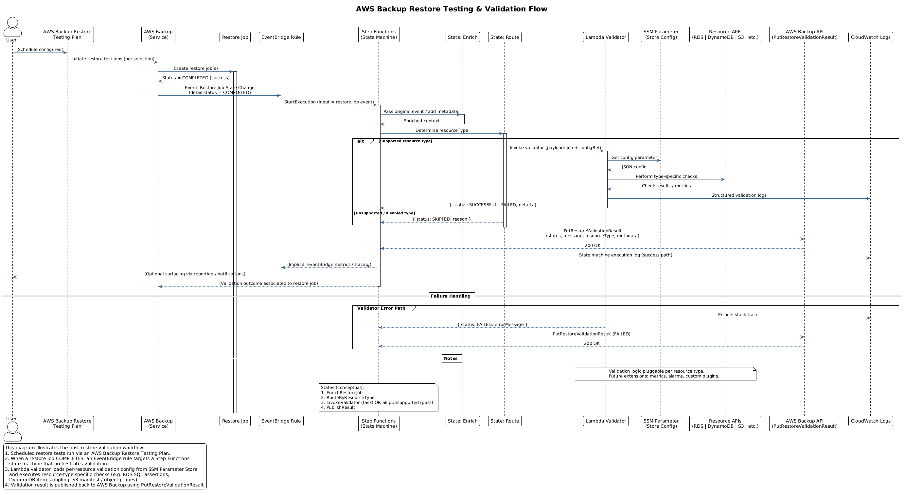

# AWS Backup Restore Testing Validation & Integrity Design

## 1. Objectives

Provide a blueprint extension that not only provisions AWS Backup Restore Testing Plans (already partially implemented via `awscc_backup_restore_testing_plan` and selections) but also validates that restored resources are *functional* and *internally consistent*. Users (blueprint implementers) define integrity checks per resource type (e.g. SQL query for RDS/Aurora, manifest verification for S3, item checks for DynamoDB) executed automatically after AWS Backup restore tests complete.

## 2. High-Level Architecture



```text
AWS Backup Restore Testing Plan (scheduled)
        │ (runs restore jobs)
        ▼
Restore Test Jobs (Test restore of latest/random recovery points)
        │ emit EventBridge events (Restore Job State Change: COMPLETED)
        ▼
EventBridge Rule (filters status=COMPLETED + restoreTestingPlanArn)
        │
        ▼
Step Functions State Machine (or direct Lambda)  <── optional batching fan‑in
  1. Fetch restore job details
  2. Dispatch per resource-type validator (Lambda / Fargate / custom)
  3. Execute user-defined integrity logic (SQL / API / S3 diff etc.)
  4. Aggregate results
  5. Call PutRestoreValidationResult (per restore job)
  6. Emit metrics + SNS / EventBridge notifications
        │
        ▼
CloudWatch Metrics / Logs / Alarms + Backup Console Validation Status
```

### Why Step Functions?

- Orchestrates retries, parallel fan-out per restored resource
- Standardises timeout + backoff policies
- Simplifies conditional branching for resource types
- Enables centralised audit trail for validation workflow

A simpler single Lambda path remains possible for minimal setups; design supports either.

> For an ad-hoc, customer‑supplied validator workflow (manual restore + external Lambda validation without Step Functions), see `manual-restore-validation.md`.

## 3. Data & Control Flows

| Flow | Source → Target | Notes |
|------|-----------------|-------|
| A | AWS Backup → EventBridge | "Restore Job State Change" event, includes `restoreJobId`, `resourceType`, `createdResourceArn`, `restoreTestingPlanArn` |
| B | EventBridge → Step Functions | Input filtered by plan ARN / resource types |
| C | Step Functions → AWS Backup API | `DescribeRestoreJob` for enrichment |
| D | Step Functions → Validator Lambdas | One per resource type OR generic dispatcher |
| E | Validators → Target resource | Run integrity checks (SQL, scan, HEAD, etc.) |
| F | Validators → AWS Backup | `PutRestoreValidationResult(ValidationStatus=SUCCESSFUL\|FAILED\|SKIPPED)` |
| G | Step Functions → CloudWatch / SNS | Emit metrics, structured JSON log, optional alert |

## 4. State Machine Definition (Express or Standard)

Recommended: **Standard** (because restores may take hours; we only start after COMPLETED but validation might be longer running for large datasets). Express acceptable if you guarantee short validations.

Proposed states (Amazon States Language pseudo):

```json
{
  "Comment": "Restore Test Validation Orchestrator",
  "StartAt": "Init",

  "States": {
    "Init": { "Type": "Pass", "ResultPath": "$.context", "Next": "EnrichRestoreJob" },
    "EnrichRestoreJob": { "Type": "Task", "Resource": "arn:aws:states:::aws-sdk:backup:describeRestoreJob", "Parameters": { "RestoreJobId": "$.detail.restoreJobId" }, "ResultPath": "$.restoreJob", "Next": "RouteByResourceType" },
    "RouteByResourceType": { "Type": "Choice", "Choices": [
        { "Variable": "$.detail.resourceType", "StringEquals": "Aurora", "Next": "AuroraValidation" },
        { "Variable": "$.detail.resourceType", "StringEquals": "RDS", "Next": "RDSValidation" },
        { "Variable": "$.detail.resourceType", "StringEquals": "DynamoDB", "Next": "DynamoValidation" },
        { "Variable": "$.detail.resourceType", "StringEquals": "S3", "Next": "S3Validation" }
      ], "Default": "GenericSkip" },
    "AuroraValidation": { "Type": "Task", "Resource": "${lambda_arn_aurora}" , "ResultPath": "$.validation", "Next": "PublishResult" },
    "RDSValidation": { "Type": "Task", "Resource": "${lambda_arn_rds}" , "ResultPath": "$.validation", "Next": "PublishResult" },
    "DynamoValidation": { "Type": "Task", "Resource": "${lambda_arn_dynamo}" , "ResultPath": "$.validation", "Next": "PublishResult" },
    "S3Validation": { "Type": "Task", "Resource": "${lambda_arn_s3}" , "ResultPath": "$.validation", "Next": "PublishResult" },
    "GenericSkip": { "Type": "Pass", "Result": { "status": "SKIPPED", "message": "No validator implemented for resourceType" }, "ResultPath": "$.validation", "Next": "PublishResult" },
    "PublishResult": { "Type": "Task", "Resource": "arn:aws:states:::aws-sdk:backup:putRestoreValidationResult", "Parameters": { "RestoreJobId": "$.detail.restoreJobId", "ValidationStatus": "$.validation.status", "ValidationStatusMessage": "$.validation.message" }, "Next": "EmitMetrics" },
    "EmitMetrics": { "Type": "Task", "Resource": "${lambda_arn_metrics}", "End": true }
  }
}
```

Notes:

- `${lambda_arn_*}` produced conditionally via Terraform based on enabled validators.
- Timeout & retry policies applied per Task (e.g. RDS 5 min, S3 2 min, Dynamo 1 min) with `Retry` blocks.
- Could collapse validators into one generic Lambda with plugin pattern.

## 5. Extensibility Interface

Users supply validation definitions via Terraform variables consumed by validator Lambda(s).

### 5.1 Terraform Variables (additions)

```hcl
variable "restore_validation_config" {
  description = "Map keyed by resource type containing validation directives."
  type = object({
    rds = optional(object({
      enabled          = bool
      cluster_identifiers = optional(list(string))
      sql_checks = list(object({
        database = string
        statement = string
        expected_rows = optional(number)
        expected_hash = optional(string) # SHA256 of concatenated row values
        timeout_seconds = optional(number)
      }))
      secret_arn = string # AWS Secrets Manager ARN for master creds or read-only
    }))
    dynamodb = optional(object({
      enabled = bool
      tables  = list(string)
      checks = list(object({
        table        = string
        expected_item_count = optional(number)
        key_sample = optional(list(object({
          pk = string
          sk = optional(string)
          expected_item_hash = optional(string)
        })))
      }))
    }))
    s3 = optional(object({
      enabled = bool
      buckets = list(object({
        name = string
        manifest_s3_uri = optional(string) # points to authoritative manifest
        sample_prefixes = optional(list(string))
        compare_object_tags = optional(bool)
      }))
    }))
    aurora = optional(object({
      enabled   = bool
      clusters  = list(string)
      sql_checks = list(object({
        cluster_endpoint = optional(string)
        database  = string
        statement = string
        expected_rows = optional(number)
      }))
      secret_arn = string
    }))
  })
  default = {}
}
```


### 5.2 Lambda Validator Contract

All validator handlers accept unified event schema:

```json
{
  "restoreJobId": "string",
  "resourceType": "RDS|Aurora|DynamoDB|S3|...",
  "createdResourceArn": "arn:aws:...",
  "config": { "...resource specific config subset..." }
}
```
Return object:


```json
{ "status": "SUCCESSFUL|FAILED|SKIPPED", "message": "Human readable" }
```


### 5.3 Packaging Strategy

- Single Lambda with language (Python/Node) loads `config` JSON from SSM Parameter or encrypted file in S3 (to avoid large env variables)
- Pluggable validators registered in a dict keyed by resource type
- Optional user-provided Lambda ARN override per resource type for complete custom logic

### 5.4 Validation Logic Patterns

| Resource | Strategy | Failure Conditions |
|----------|----------|-------------------|
| RDS/Aurora | Execute SQL checks (each inside txn, read-only) | Query error, row count mismatch, hash mismatch, timeout |
| DynamoDB | DescribeTable + (optional) Scan limit or PartiQL key gets | Table missing, item count variance > threshold, sample hash mismatch |
| S3 | HEAD sample objects, optional compare against manifest (object key + size + etag) | Missing objects, size/etag mismatch, manifest not accessible |
| EBS (future) | (Optional) Attach test volume to temp instance and run FS metadata probe script | Attach failure, FS errors |

## 6. Examples

### 6.1 RDS Example Config

```hcl
restore_validation_config = {
  rds = {
    enabled = true
    secret_arn = aws_secretsmanager_secret.rds_ro.arn
    sql_checks = [
      { database = "appdb", statement = "SELECT COUNT(*) c FROM customers", expected_rows = 1 },
      { database = "appdb", statement = "SELECT sha256(string_agg(id || ':' || status, ',' ORDER BY id)) h FROM orders", expected_hash = "abc123..." }
    ]
  }
}
```

### 6.2 DynamoDB Example Config

```hcl
restore_validation_config = {
  dynamodb = {
    enabled = true
    tables = ["orders", "customers"]
    checks = [
      { table = "orders", expected_item_count = 15000 },
      { table = "customers", key_sample = [ { pk = "CUST#123", expected_item_hash = "d41d8cd98f" } ] }
    ]
  }
}
```

### 6.3 S3 Example Config

```hcl
restore_validation_config = {
  s3 = {
    enabled = true
    buckets = [{
      name = "images-bucket",
      manifest_s3_uri = "s3://manifests-prod/images-bucket.manifest.json",
      sample_prefixes = ["2025/09/", "2025/08/"]
    }]
  }
}
```

## 7. Security & Compliance

- IAM: Validators assume dedicated role with least-privilege policies (RDS: `rds-data:ExecuteStatement` / `secretsmanager:GetSecretValue`; DynamoDB: `DescribeTable`, `GetItem`, limited `Scan` with `Limit`; S3: `HeadObject`, `GetObject` for manifest)
- Secrets: Use Secrets Manager for DB creds; do not log credentials or query data
- KMS: Encrypt Lambda environment variables, S3 manifest bucket, and Secrets Manager secret
- Network: For RDS/Aurora in private subnets, place Lambda in same VPC subnets with least required SG egress
- Auditing: Structured JSON logs (include `restoreJobId`, `resourceType`, check identifiers)
- PII Minimisation: Hash or count only; avoid selecting raw personal data rows
- Integrity of config: Optionally sign config file (S3 object with checksum validation before use)

## 8. Operational Considerations & Cost

- Throttle: Concurrency controls via Step Functions + reserved concurrency on validator Lambda to avoid storm after bulk restores
- Timeouts: Short per-check timeouts (e.g. 30s; fail fast pattern)
- Retention Window: If deeper validation requires longer retention, expose `retain_hours_before_cleanup` variable (aligns with AWS restore testing retention concept)
- Metrics: Emit CloudWatch custom metrics: `ValidationSuccess`, `ValidationFailure`, `ValidationDurationMs` with dimensions `ResourceType`, `PlanName`
- Alerting: SNS topic for failures >0 in last run, or error rate > threshold across rolling period
- Cost Levers: Limit number of SQL checks; use targeted `GetItem` vs full table scans; sample S3 objects (k=20 per prefix) unless manifest diff required

## 9. Acceptance Criteria Mapping

| Requirement | Design Element |
|------------|----------------|
| "Ability from the blueprint to run automated test to validate restoration" | EventBridge + Step Functions + validators triggered on restore completion |
| "Test integrity of restored resource, specific to blueprint implementer" | `restore_validation_config` + per-resource plugin architecture |
| "Define an SQL query for RDS to test integrity" | `sql_checks` array with expected rows/hash support |
| "Customer responsible for defining and validating check" | User supplies Terraform variable config and (optionally) custom Lambda override |
| "Step function would just allow this functionality" | State machine orchestrates and records results via `PutRestoreValidationResult` |

## 10. Future Enhancements

- Add cross-account validation (restore to isolated test account, assume role back)
- Support FSx / EFS mount probing using Fargate task
- Provide Terraform module subfolder `validation` generating Step Functions + default validator Lambda
- Add canned dashboards (CloudWatch) for validation pass rate & duration

## 11. Terraform Module Additions (Summary)

Minimal initial scope:

1. New optional module `aws-backup-validation` OR integrated into `aws-backup-source` behind feature flag `enable_restore_validation`
2. Resources:
   - EventBridge rule
   - Step Functions state machine (JSON from templatefile)
   - IAM roles/policies (state machine + lambda)
   - Validator Lambda (zip from local build or external source)
   - SSM Parameter / S3 object for config JSON
3. Variables: `enable_restore_validation`, `restore_validation_config`, `custom_validator_lambda_arns` (map)
4. Outputs: `restore_validation_state_machine_arn`, `restore_validation_config_parameter_arn`

Current prototype implementation lives in `modules/aws-backup-validation` and provides a minimal Lambda + Step Functions + EventBridge rule path. Future iterations should harden IAM scoping and expand validator logic prior to production adoption.

## 12. Example User Flow

1. Enable restore testing (already done with existing plan resources)
2. Set `enable_restore_validation = true`
3. Provide `restore_validation_config` with at least one resource type
4. Apply Terraform – deploys validation infra
5. Wait for scheduled restore test; Step Functions records validation results
6. View status in AWS Backup Console / CloudWatch dashboard

## 13. Risks & Mitigations

| Risk | Mitigation |
|------|------------|
| Long-running SQL leads to Lambda timeout | Enforce per-query timeout + limit operations (SELECT only) |
| Validator failure blocks result publishing | Wrap each validator in try/catch; on unhandled exception mark FAILED with reason |
| Sensitive data leakage in logs | Scrub query parameters and row data; log only counts + hashes |
| Drift between Terraform config and live validator config | Version config (include checksum) and log version per run |
| Excess costs from scanning large DynamoDB tables | Use item count from `DescribeTable` and targeted sample keys, avoid full scans |

## 14. Open Questions

- Provide managed library of validation query templates? (Out of initial scope)
- Should retention hours be explicitly configurable per selection via Terraform? (Potential future variable)
- Add option for concurrency-limited validation queue (SQS + Lambda) instead of Step Functions? (Future scale consideration)

